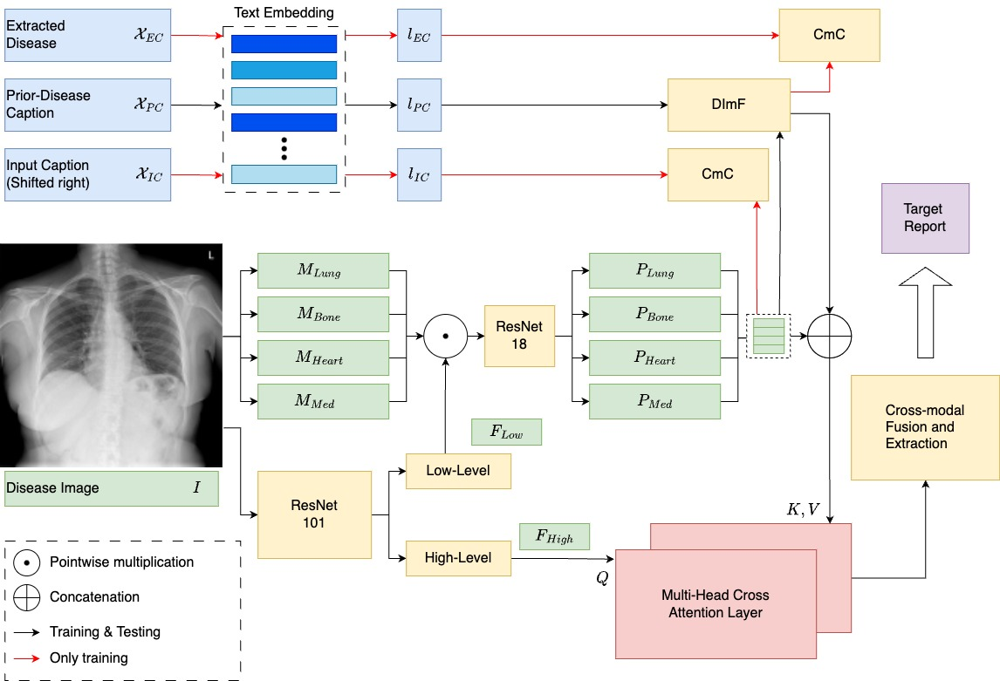

# [WACV 2024] Complex Organ Mask Guided Radiology Report Generation

This is the implementation of COMG Model: Complex Organism Mask Guided Radiology Report Generation Model.

## Abstract



## Requirements

```bash
conda env create -f environment.yaml # method 1
pip install -r requirements.txt # method 2
```

#### pycocoevalcap
```bash
Download evaluation metrics
https://github.com/zhjohnchan/R2GenCMN/tree/main/pycocoevalcap
```
``` bash
|-- COMG_model
|   |-- data
|   |-- pycocoevalcap
|   |-- logfile_saved
|   |-- models
|   |-- modules
|   |-- preprocess_mask
|   |-- results
|   |-- compute_ce.py
|   |-- ...........

|-- COMG_model_RL
|   |-- data
|   |-- pycocoevalcap
|   |-- logfile_saved
|   |-- models
|   |-- modules
|   |-- preprocess_mask
|   |-- results
|   |-- compute_ce.py
|   |-- ...........
```
Tips:
1.  Please make sure all files exist (if not, please create them by yourself) to avoid some mistakes happening.
## Datasets

We use two datasets (IU X-Ray and MIMIC-CXR) in our paper

For `IU X-Ray`, you can download the dataset from [here](https://openi.nlm.nih.gov/faq) and then put the files in `data`.

For `MIMIC-CXR`, you can download the dataset from [here](https://physionet.org/content/mimic-cxr/2.0.0/) and then put the files in `data`.

Put data into the data file
```bash
|-- data
|   |-- IU_xray
|       |-- images
|           |-- .......
|       |-- annotation.json
|       |-- annotation_disease.json
|   |-- mimic_cxr
|       |-- images
|           |-- .......
|       |-- annotation.json
|       |-- annotation_disease.json
```
### Generate Mask

Generate Mask by using [Chest X-Ray Anatomy Segmentation model](https://github.com/ConstantinSeibold/ChestXRayAnatomySegmentation/)

```bash
cd COMG_model/preprocess_mask
bash generate_mask.sh
```

```bash
|-- data
|   |-- IU_xray
|       |-- images
|       |-- annotation.json
|       |-- annotation_disease.json
|   |-- IU_xray_segmentation (generated)
|       |-- CXR1_1_IM-00001
|       |-- mask files .......
|   |-- mimic_cxr
|       |-- images
|       |-- annotation.json
|       |-- annotation_disease.json
|   |-- mimic_cxr_segmentation (generated)
|       |-- images
|           |-- mask files ......
```
Tips:
1. `iu-xray` mask: almost **147 G** and **30 min**
2. `mimic-cxr` mask: almost **179 G** and **5 h**

## Train & test - The First stage

```bash
# IU xray
cd COMG_model
bash train_iu_xray.sh
bash test_iu_xray.sh
# mimic-cxr
bash train_mimic_cxr.sh
bash test_mimic_cxr.sh
# visualization - mimic-cxr
bash plot_mimic_cxr.sh
```

## Train & test - RL - The Second stage
```bash
# IU-xray
# train
cd COMG_model_RL 
bash scripts/iu_xray/run_rl.sh
# test
cd ../COMG_model
bash test_iu_xray.sh
# MIMIC-CXR
# train
cd COMG_model_RL 
bash scripts/mimic_cxr/run_rl.sh
# test
cd ../COMG_model
bash test_mimic_cxr.sh
```
Tips: 
1. Please copy the pycocoevalcap and preprocess_mask files into the COMG_model_RL file.
2. Please copy the result from COMG_RL to the COMG file for testing results.
3. This file is the second stage training which means it needs to training based on the first stage model weight.


## Checkpoints Download
You can download the models we trained for each dataset from [here](https://unisydneyedu-my.sharepoint.com/:f:/g/personal/tigu8498_uni_sydney_edu_au/El3yDm4XPdhDkRlmm8g9rCQBrqVtTPOs1ABMtzNqtnMhJw?e=kaKc6I)

## Result


## Citation
If you find this project useful in your research, please cite the following papers:
```bibtex
@inproceedings{COMG_2024_WACV,
    title={COMG Model: Complex Organism Mask Guided Radiology Report Generation Model},
    author={Gu, Tiancheng and Liu, Dongnan and Li, Zhiyuan and Cai, Weidong},
    booktitle={IEEE/CVF Winter Conference on Applications of Computer Vision (WACV)},
    year={2024}
}
```


## Acknowledgement

Our project references the codes in the following repos. Thanks for their works and sharing.

* [R2GenCMN](https://github.com/zhjohnchan/R2GenCMN)

* [R2GenRL](https://github.com/synlp/R2GenRL)
